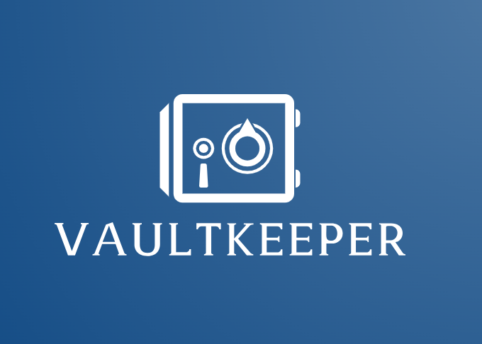

# 🔒 VaultKeeper: Elevating Your Digital Security for Passwords and Banking Cards 💳

VaultKeeper is the ultimate solution to simplify and secure your digital life. With VaultKeeper, you can efficiently and securely manage your passwords and banking details, all within an encrypted vault. No more juggling multiple credentials; our app provides hassle-free access to both your accounts and banking cards, all within a safeguarded and encrypted environment.

VaultKeeper is designed to be your all-in-one digital security companion. The app ensures that every password and piece of financial information you store is encrypted with the latest security protocols. This encryption is not only robust but also ensures that even if your device is lost or stolen, **your data remains inaccessible to unauthorized users.**

With VaultKeeper, you can generate strong, unique passwords for every account and store them safely. The intuitive interface, powered by Jetpack Compose, makes navigation and management of your data straightforward and enjoyable. No more struggling with remembering multiple passwords or worrying about the security of your banking information.

  
  
  
  
  

## Key Features:

* **🔐 Top-Notch Security:** VaultKeeper uses advanced encryption to ensure your passwords and financial data are always protected.
* **⚡ Easy and Fast Access:** Manage your passwords and banking cards from anywhere, anytime, without complications.
* **🎨 Modern and Intuitive Interface:** Designed with the latest design technologies, including Jetpack Compose, offering a seamless and attractive user experience.
* **🛠️ Comprehensive Management:** From creating secure passwords to managing card details, VaultKeeper covers all your digital security needs.
Best Practices and Modern Technologies:

At VaultKeeper, we have applied the best mobile architecture practices and design patterns to ensure a robust and scalable application. Our approach includes:

* **🏗️ Clean Architecture:** To ensure maintainable and testable code.
* **📐 Design Patterns: Implementation of patterns like MVI (Model-View-Intent) for clear separation of concerns.
* **🚀 Jetpack Compose:** Utilizing the latest Android ecosystem innovations to build declarative and reactive user interfaces.
* **🔧 Jetpack Components:** Integration with Jetpack components for more efficient development and advanced features.

## User Benefits:

* **🛡️ Peace of Mind and Security:** Enjoy the peace of mind knowing your data is protected with the highest security standards.
* **⏱️ Efficiency and Convenience:** Simplify your digital life by having all your critical information in one securely accessible place.
* **🌟 Innovation and Modernity:** Experience an app that is not only functional but also modern and at the forefront of mobile technology.

## Seamless User Experience:

I have focused on providing a seamless user experience by leveraging modern Android technologies. Jetpack Compose allows us to create a responsive and visually appealing interface that adapts to various screen sizes and orientations. The integration with Jetpack components ensures that your data synchronization, background tasks, and navigation flows are smooth and reliable.

## Security at Its Core:

Security is at the heart of VaultKeeper. We implement best practices in cryptographic algorithms and key management to keep your data secure. Additionally, our use of Clean Architecture and MVVM design pattern ensures that our codebase is organized, maintainable, and easily testable, which translates into a more secure and reliable application.

## Clean Architecture
VaultKeeper employs Clean Architecture principles to ensure the app is scalable, maintainable, and testable. Clean Architecture separates the code into distinct layers, each with clear responsibilities:

* **Presentation Layer:** This layer, built with Jetpack Compose, handles the UI and user interactions. It communicates with the ViewModel to retrieve data and update the UI reactively.
* **Domain Layer:** This is the core of the application, containing business logic and application rules. It includes use cases that orchestrate the flow of data to and from the presentation and data layers.
* **Data Layer:** This layer is responsible for data management. It includes repositories that abstract the data sources, whether they are local (Room database) or remote (Firestore).

### Data Sources
VaultKeeper ensures data persistence and security using a combination of local and remote data sources:

* **Local Data Source (Room):** Room is used to cache debit card information locally. The data is encrypted using cryptographic techniques to ensure security even if the device is compromised.
* **Remote Data Source (Firestore):** Firestore serves as the remote data repository, ensuring data is not lost even if the app is uninstalled. Firestore provides real-time data synchronization and offline support.

### Cryptographic Techniques
To protect user data, VaultKeeper implements robust cryptographic practices:

### Encryption and Key Management:

Master Key and Salt: Each user's data is encrypted with a unique master key and salt, which are generated programmatically and stored securely in Firestore.
Data Encryption: All sensitive information, including passwords and banking details, is encrypted using the master key and salt.
Application Master Key: The master keys and salts are encrypted using the application's master key. This key is stored in a secure .so file, accessible via Java NDK, preventing extraction through decompilation.

### Key Storage:

The .so file containing the application's master key ensures that the key cannot be easily extracted by attackers, enhancing the security of the encryption keys stored in Firestore.
Summary
VaultKeeper leverages modern Android development practices and robust security mechanisms to offer a secure, efficient, and user-friendly solution for managing passwords and banking details. By utilizing Clean Architecture, Room for local caching, Firestore for remote data storage, and advanced cryptographic techniques, VaultKeeper ensures that user data remains secure and accessible across devices. The integration of Jetpack Compose and other Jetpack components further enhances the app's performance and user experience, making it a reliable and innovative digital security companion.

