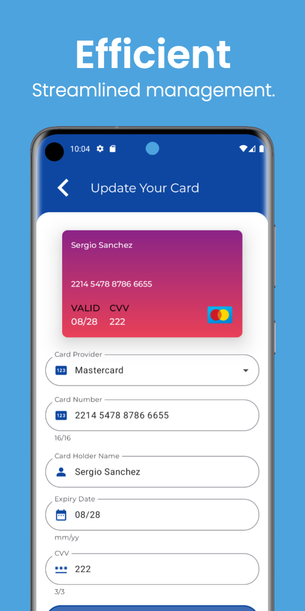
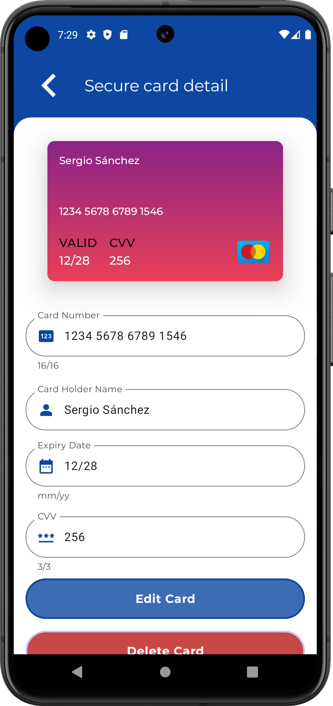

# 🔒 VaultKeeper: Elevating Your Digital Security for Passwords and Banking Cards 💳


🚀 **VaultKeeper**: The ultimate solution to simplify and secure your digital life! With VaultKeeper, you can efficiently and securely manage your passwords and banking details, all within an encrypted vault. 🔐

🔑 No more juggling multiple credentials; our app provides hassle-free access to both your accounts and banking cards, all within a safeguarded and encrypted environment.

👨‍💻 VaultKeeper is designed to be your all-in-one digital security companion. The app ensures that every password and piece of financial information you store is encrypted with the latest security protocols. This encryption is not only robust but also ensures that even if your device is lost or stolen, your data remains inaccessible to unauthorized users. 🛡️

🔒 With VaultKeeper, you can generate strong, unique passwords for every account and store them safely. The intuitive interface, powered by Jetpack Compose, makes navigation and management of your data straightforward and enjoyable. No more struggling with remembering multiple passwords or worrying about the security of your banking information.

This app, **VaultKeeper**, includes images and resources designed by [Freepik](https://www.freepik.com). We would like to acknowledge and thank Freepik for their incredible design assets. The images used in the app are provided with attribution, as required by Freepik's licensing terms. For more information on Freepik's resources, please visit [www.freepik.com](https://www.freepik.com).

I would like to express my sincere appreciation to [**devprincefahad**](https://github.com/devprincefahad) for their work on the **Securify** app, which served as an inspiration for **VaultKeeper**. While my app draws design inspiration from **Securify**, I have taken a different approach in terms of architecture, features, and overall implementation to better align with my vision for secure password and banking data management.  

Learn more about **Securify** and its contribution to digital security on [GitHub](https://github.com/devprincefahad/Securify).  

<p align="center">
  
  
  
  
  
</p>

<p align="center">
  
  
  
  
  
</p>

Slides are built using the  template from [Previewed](https://previewed.app/template/AFC0B4CB). I extend my gratitude to them for their remarkable work and contribution.

## 🚀 Unlock New Experiences with These Jetpack Compose Apps  

If you love innovation and high-quality mobile experiences, check out my other apps built with **Jetpack Compose**!  

+ 🎨 [ArtNiche – NFT Art Marketplace](https://github.com/sergio11/art_niche_nft_marketplace)  
🖼️ A digital marketplace designed for artists and collectors. Buy, sell, and create NFTs in a seamless, intuitive experience.  

+ 🌍📸 [LingoSnap – Learn Languages with AI](https://github.com/sergio11/lingosnap)  
🗣️ Turn real-world text into interactive lessons. Just snap a photo, and **LingoSnap** will teach you vocabulary, grammar, and pronunciation.  

+ 🖼️ [Artify – Virtual Art Gallery](https://github.com/sergio11/artify)  
🏛️ Explore art with advanced technology. Discover details and context about artworks simply by capturing an image.  

+ 👗 [ChicFit – Your AI Fashion Assistant](https://github.com/sergio11/chicfit)  
📸🤖 Get outfit suggestions and style recommendations powered by AI. Always look your best for any occasion!  

+ 🔍📚 [Inquize – Capture Curiosity. Unlock Knowledge.](https://github.com/sergio11/inquize_android)  
💡 Transform your device into a gateway to knowledge. Just point your camera at an object, place, or concept, and **Inquize** will provide real-time answers, turning curiosity into a learning experience.

 + 🔒 [VaultKeeper – Elevating Your Digital Security for Passwords and Banking Cards](https://github.com/sergio11/vault_keeper_android)  
💳 Securely manage your passwords and banking information with **VaultKeeper**. Enjoy hassle-free access to your accounts and cards within an encrypted vault, ensuring your data remains safe, even if your device is lost or stolen.  

## Key Features:

* **🔐 Top-Notch Security:** VaultKeeper uses advanced encryption to ensure your passwords and financial data are always protected.
* **⚡ Easy and Fast Access:** Manage your passwords and banking cards from anywhere, anytime, without complications.
* **🎨 Modern and Intuitive Interface:** Designed with the latest design technologies, including Jetpack Compose, offering a seamless and attractive user experience.
* **🛠️ Comprehensive Management:** From creating secure passwords to managing card details, VaultKeeper covers all your digital security needs.
Best Practices and Modern Technologies:

At VaultKeeper, we have applied the best mobile architecture practices and design patterns to ensure a robust and scalable application. Our approach includes:

* **🏗️ Clean Architecture:** To ensure maintainable and testable code.
* **📐 Design Patterns:** Implementation of patterns like MVI (Model-View-Intent) for clear separation of concerns.
* **🚀 Jetpack Compose:** Utilizing the latest Android ecosystem innovations to build declarative and reactive user interfaces.
* **🔧 Jetpack Components:** Integration with Jetpack components for more efficient development and advanced features.


## User Benefits:

* **🛡️ Peace of Mind and Security:** Enjoy the peace of mind knowing your data is protected with the highest security standards.
* **⏱️ Efficiency and Convenience:** Simplify your digital life by having all your critical information in one securely accessible place.
* **🌟 Innovation and Modernity:** Experience an app that is not only functional but also modern and at the forefront of mobile technology.

## Developed with Brownie UI Library

🍫 **Brownie**: [Jetpack Compose UI Library](https://github.com/sergio11/brownie_ui_library) 🚀

Brownie is a 🌟 Jetpack Compose library module that provides a set of pre-defined components to accelerate the development of Android interfaces and applications. It is designed to help developers apply best practices in screen state management and utilize the most effective design patterns in their projects.

### Features 🎉

- **Pre-defined Components**: Brownie offers a variety of ready-to-use components, from buttons to lists and cards, to facilitate the creation of attractive and consistent user interfaces.
- **State Management**: Facilitates screen state management by implementing patterns such as MVI (Model-View-Intent) or MVVM (Model-View-ViewModel).
- **Customization**: Brownie components are highly customizable and can easily adapt to the visual style of any application.
- **Jetpack Compose Compatibility**: Fully integrated with Jetpack Compose, the modern Android UI library, to ensure optimal performance and a smooth development experience.

### Model-View-Intent (MVI) Architecture 🏗️

Brownie encourages the use of the Model-View-Intent (MVI) architecture pattern for effective screen state management. In this pattern:

- **Model**: Represents the state of the UI. Brownie provides a `BrownieViewModel` class that extends from `ViewModel` and handles the UI state.
- **View**: Renders the UI based on the state provided by the ViewModel. Brownie components are seamlessly integrated with Compose to create a declarative UI.
- **Intent**: Represents user actions or events that trigger state changes. Brownie's components, like buttons and text fields, are designed to emit these intents efficiently.

This setup leverages Brownie's components and ViewModel to accelerate the development of robust features while adhering to best practices in architecture and UI design.

For more information, check out the [Brownie UI Library on GitHub](https://github.com/sergio11/brownie_ui_library) and give it a ⭐ star to show your support!

## 🌟 Seamless User Experience

I have focused on providing a seamless user experience by leveraging cutting-edge Android technologies. Jetpack Compose enables me to create a responsive and visually appealing interface that adapts to various screen sizes and orientations. Integration with Jetpack components ensures smooth data synchronization, reliable background tasks, and efficient navigation flows, resulting in a fluid and enjoyable user experience.

## 🔒 Security at Its Core

Security is at the heart of VaultKeeper. I implement industry best practices in cryptographic algorithms and key management to ensure your data is always protected. My use of Clean Architecture and the MVVM design pattern ensures the codebase is organized, maintainable, and easily testable, translating into a more secure and reliable application.

##  🏗️ Clean Architecture
VaultKeeper employs Clean Architecture principles to ensure the app is scalable, maintainable, and testable. Clean Architecture separates the code into distinct layers, each with clear responsibilities:

* **🎨 Presentation Layer:** Built with Jetpack Compose, this layer handles the UI and user interactions. It communicates with the ViewModel to retrieve data and update the UI reactively.
* **💡 Domain Layer:** The core of the application, containing business logic and application rules. It includes use cases that orchestrate the flow of data to and from the presentation and data layers.
* **🗄️ Data Layer:** Responsible for data management, this layer includes repositories that abstract the data sources, whether they are local (Room database) or remote (Firestore).

## 📊 Data Sources

VaultKeeper ensures data persistence and security using a combination of local and remote data sources:

* **📂 Local Data Source (Room):** Room is used to cache debit card information locally. The data is encrypted using advanced cryptographic techniques to ensure security, even if the device is compromised.
* **☁️ Remote Data Source (Firestore):** Firestore serves as the remote data repository, ensuring data is not lost even if the app is uninstalled. Firestore provides real-time data synchronization and offline support.

## 🛡️ Cryptographic Techniques
To protect user data, VaultKeeper implements robust cryptographic practices:

* **🔑 Master Key and Salt:** Each user's data is encrypted with a unique master key and salt, which are generated programmatically and stored securely in Firestore.
* **🔐 Data Encryption:** All sensitive information, including passwords and banking details, is encrypted using the master key and salt.
* **🗝️ Application Master Key:** The master keys and salts are encrypted using the application's master key. This key is stored in a secure .so file, accessible via Java NDK, preventing extraction through decompilation.

##    🔏 Key Storage

The .so file containing the application's master key ensures that the key cannot be easily extracted by attackers, enhancing the security of the encryption keys stored in Firestore.

## App Screenshots

Here are some screenshots from our app to give you a glimpse of its design and functionality.





## Contribution
Contributions to VaultKeeper are highly encouraged! If you're interested in adding new features, resolving bugs, or enhancing the project's functionality, please feel free to submit pull requests.

## Credits
VaultKeeper is developed and maintained by Sergio Sánchez Sánchez (Dream Software). Special thanks to the open-source community and the contributors who have made this project possible. If you have any questions, feedback, or suggestions, feel free to reach out at dreamsoftware92@gmail.com.

## Acknowledgements 🙏

 - Special thanks to **devprincefahad** for the Securify app, which served as a source of inspiration for this project. Visit [Securify](https://github.com/devprincefahad/Securify).

- We express our deep appreciation to [Freepik](https://www.freepik.es/) for generously providing the resources used in this project.

- <div> Icons and images takes from <a href="https://www.freepik.com" title="Freepik"> Freepik </a> from <a href="https://www.flaticon.es/" title="Flaticon">www.flaticon.es'</a></div>
- Template mockup from https://previewed.app/template/AFC0B4CB

 ## Visitors Count

 
 
 ## Please Share & Star the repository to keep me motivated.
  <a href = "https://github.com/sergio11/vault_keeper_android/stargazers">
     
  </a>

## License ⚖️

This project is licensed under the MIT License, an open-source software license that allows developers to freely use, copy, modify, and distribute the software. 🛠️ This includes use in both personal and commercial projects, with the only requirement being that the original copyright notice is retained. 📄

Please note the following limitations:

- The software is provided "as is", without any warranties, express or implied. 🚫🛡️
- If you distribute the software, whether in original or modified form, you must include the original copyright notice and license. 📑
- The license allows for commercial use, but you cannot claim ownership over the software itself. 🏷️

The goal of this license is to maximize freedom for developers while maintaining recognition for the original creators.

```
MIT License

Copyright (c) 2024 Dream software - Sergio Sánchez 

Permission is hereby granted, free of charge, to any person obtaining a copy
of this software and associated documentation files (the "Software"), to deal
in the Software without restriction, including without limitation the rights
to use, copy, modify, merge, publish, distribute, sublicense, and/or sell
copies of the Software, and to permit persons to whom the Software is
furnished to do so, subject to the following conditions:

The above copyright notice and this permission notice shall be included in all
copies or substantial portions of the Software.

THE SOFTWARE IS PROVIDED "AS IS", WITHOUT WARRANTY OF ANY KIND, EXPRESS OR
IMPLIED, INCLUDING BUT NOT LIMITED TO THE WARRANTIES OF MERCHANTABILITY,
FITNESS FOR A PARTICULAR PURPOSE AND NONINFRINGEMENT. IN NO EVENT SHALL THE
AUTHORS OR COPYRIGHT HOLDERS BE LIABLE FOR ANY CLAIM, DAMAGES OR OTHER
LIABILITY, WHETHER IN AN ACTION OF CONTRACT, TORT OR OTHERWISE, ARISING FROM,
OUT OF OR IN CONNECTION WITH THE SOFTWARE OR THE USE OR OTHER DEALINGS IN THE
SOFTWARE.
```
